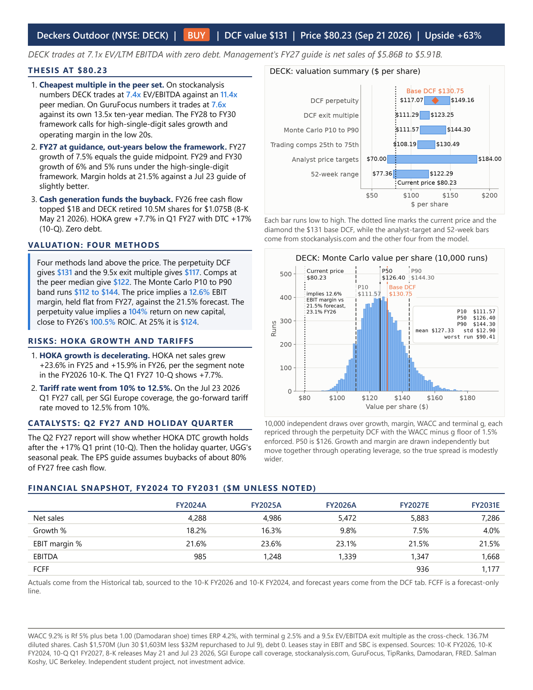

# DECK DCF: valuation of Deckers Outdoor (NYSE: DECK)



[One-page pitch (PDF)](onepager/DECK_pitch.pdf) and [Excel model](model/deck_dcf.xlsx).

## Overview

A DCF and Monte Carlo on Deckers Outdoor, fiscal year ending Mar 31, base year FY2026. Everything downstream of the two input csvs is generated, so the Excel model carries live formulas only and the one-pager reads its numbers back from the saved workbook.

## Result

The perpetuity DCF gives $130.75 per share against a $80.23 close on 2026-09-21. Upside is 63.0%. The exit-multiple cross-check at 9.5x EV/EBITDA gives $117.15 and comps at the 11.4x peer median give $122.00. The Monte Carlo P10 to P90 band runs $111.57 to $144.30 around a P50 of $126.40. The $80.23 close implies a 12.6% EBIT margin against the 21.5% forecast and the 23.1% FY26 actual. Growth and margin are drawn independently but move together through operating leverage, so the true spread is modestly wider.

## Method

Five forecast years, FY2027 to FY2031, discounted at mid-year periods 0.5 to 4.5. WACC equals the cost of equity. Debt is zero, so the equity weight is 100% and WACC is rf 5.00% plus beta 1.00 times ERP 4.23%, which gives 9.23%. The 5-year monthly regression beta is 1.10. It is an equity beta on a firm holding cash worth 14% of its market cap. Removing that cash drag gives an operating beta of 1.28, a 10.42% cost of equity and $113.07 per share. The perpetuity method at g 2.5% is primary and the 9.5x EV/EBITDA exit multiple is the cross-check, with the exit terminal value discounted from the end of FY2031. The bridge adds cash of $1,570M, subtracts debt of 0, keeps operating leases inside EBIT, expenses SBC and divides by 136,710,227 diluted shares from the 10-Q cover plus the dilutive awards in its Note 9. Enterprise value is dated Mar 31 2026 and bridged with Jul 9 cash and shares. Rolling forward would raise value, so the omission is conservative.

## Key assumptions

Values live in inputs/assumptions.csv. The Assumptions tab mirrors that file cell for cell, and the WACC, DCF, Sensitivity and Comps calculations read from it through defined names, while the Historical and Comps tabs also carry their own blue inputs from historicals.csv and the sources named beside them.

| key | value | unit | source |
|---|---|---|---|
| `price` | $80.23 | USD | close 2026-09-21 Google Finance |
| `shares_diluted_current` | 136,710,227 | shares | 10-Q cover 136,414,227 basic as of 2026-07-09 + 296K dilutive effect of equity awards, 10-Q Note 9 |
| `cash` | 1,570,421 | USD thousands | 10-Q Q1 FY27 balance sheet 1,602,589 at 2026-06-30 less 32,168 repurchased through 2026-07-09 per 10-Q subsequent events, to match the Jul 9 share count |
| `debt` | 0 | USD thousands | 10-K |
| `rev_growth_fy27` | 7.50% | pct | FY27 guide midpoint 5.885B / FY26 net sales 5,472,296 |
| `rev_growth_fy31` | 4.00% | pct | decay |
| `ebit_margin` | 21.50% | pct | FY27 guidance ~21.5% |
| `da_pct_rev` | 1.40% | pct | FY26 10-K cash flow: Depreciation, amortization, and accretion 75,773 / Net sales 5,472,296 = 1.38% |
| `capex_pct_rev` | 1.50% | pct | FY26 10-K cash flow: Purchases of property and equipment 84,623 / Net sales 5,472,296 = 1.55% |
| `nwc_pct_rev` | 7.70% | pct | FY26 10-K balance sheet: (Trade AR 318,978 + Inventories 487,018 - Trade AP 384,529) / Net sales 5,472,296 = 7.70% |
| `tax_rate` | 23.00% | pct | FY27 guidance |
| `rf` | 5.00% | pct | FRED DGS10 2026-09-18 5.01%, rounded to 5.00% |
| `beta` | 1.00x | x | Damodaran Shoe Jan 2026 cash-corrected unlevered; DECK ~0 debt |
| `erp` | 4.23% | pct | Damodaran implied ERP start-2026; Sept 2026 not published |
| `terminal_growth` | 2.50% | pct | below nominal GDP and Rf |
| `exit_multiple_ev_ebitda` | 9.50x | x | below 13.49x 10Y median above 7.62x current |
| `mc_growth_tri` | 3,6,9 | pct | mode 6% = average of the FY27 to FY31 growth path; range +/-3pp |
| `mc_margin_tri` | 18,21.5,24 | pct | floor 18% = FY22 17.9% and FY23 18.0% EBIT margin trough, Historical!B28:C28; mode 21.5% = FY27 guide; cap 24% just above FY25 23.6% peak |
| `mc_wacc_normal` | 9.23,0.5 | pct | centered on base WACC |
| `mc_g_tri` | 1.5,2.5,3.0 | pct | mode = base terminal g 2.5%; max 3.0%, below nominal GDP and Rf; min 1.5% |

## Data sources

All filings came from SEC EDGAR. The FY2024 10-K supplies FY2022 and FY2023 and the FY2026 10-K supplies FY2024 to FY2026, with XBRL companyfacts as the cross-check on every line item in inputs/historicals.csv. The Q1 FY2027 10-Q supplies the Jun 30 2026 balance sheet and the quarter that closes the LTM window.

| filing | period | accession | primary document |
|---|---|---|---|
| 10-K FY2026 | FYE 2026-03-31, filed 2026-05-22 | `0001628280-26-037664` | `deck-20260331.htm` |
| 10-K FY2024 | FYE 2024-03-31, filed 2024-05-24 | `0000910521-24-000017` | `deck-20240331.htm` |
| 10-Q Q1 FY2027 | quarter ended 2026-06-30, filed 2026-07-30 | `0000910521-26-000022` | `deck-20260630.htm` |
| 8-K | 2026-05-21, FY2026 results and FY2027 guidance | `0000910521-26-000007` | deck-20260521.htm (8-K cover, verified in submissions.json). Content used: EX-99.1 press release deckex991pressrelease-3312.htm, self-labeled EX-99.1 and dated May 21 2026 inside the file |
| 8-K | 2026-07-23, Q1 FY2027 results and guidance update | `0000910521-26-000015` | deck-20260723.htm (8-K cover, verified in submissions.json). Content used: EX-99.1 press release deckex991pressrelease-6302.htm, self-labeled EX-99.1 and dated July 23 2026 inside the file |

| other source | used for |
|---|---|
| Damodaran, Jan 2026 | industry beta (shoe, cash-corrected unlevered) and implied ERP |
| FRED DGS10 | 10-year Treasury yield for the risk-free rate |
| Google Finance | closing price on 2026-09-21 |
| Yahoo Finance via yfinance | DECK and SPY monthly returns for the regression beta, a same-currency cross-check on the comps |
| stockanalysis.com, retrieved Sep 2026 | peer EV/EBITDA multiples for CROX, NKE, ONON, BIRK and SHOO, DECK EV/EBITDA 7.39x, analyst price targets and count, 52-week range |
| GuruFocus, retrieved Sep 2026 | peer EV/EBITDA multiples for CROX and WWW, DECK EV/EBITDA 7.62x and its 13.49x 10-year median |
| TipRanks | the 18.46x alternate BIRK multiple recorded on the Comps tab |
| SGI Europe | coverage of the Jul 23 2026 Q1 FY27 call: go-forward tariff rate 12.5% from 10% |

## Repo layout

```
inputs/           assumptions.csv, historicals.csv, beta.csv
model/            deck_dcf.xlsx, build_dcf.py (builder), verify_dcf.py (recalc + checks)
mc/               deck_mc.py, mc_summary.csv, hist.png, tornado.png
onepager/         build_onepager.py, DECK_pitch.pdf, DECK_pitch.html, football.png, number_map.csv, preview.png
filings/          10K_FY2026_Item7_FS.md, 10K_FY2024_FS.md, 10Q_Q1FY27.md, 8K_releases_May_Jul_2026.md
source/           raw EDGAR downloads, gitignored
build_readme.py   writes README.md from the workbook
requirements.txt  pinned packages
```

source/ is gitignored. The generated files under model/, mc/, onepager/ and the README are rebuilt by the scripts beside them, inputs/ holds the csvs that every script reads, and filings/ holds the text extracts of the five filings that the csvs cite.

## Reproduce

Excel must be installed. Steps 2 and 4 open the workbook through pywin32 COM to recalculate and save cached values, so the chain runs on Windows with Microsoft Excel and does not run under LibreOffice.

1. `py -3.13 -m pip install -r requirements.txt`
2. `py -3.13 model/build_dcf.py` builds the workbook from the csvs, then recalculates and saves it through Excel (the MC tab reports mc_summary.csv missing on this first pass).
3. Then `py -3.13 mc/deck_mc.py`, which reconciles its base case to the saved price_perp before drawing 10,000 scenarios with seed 42.
4. `py -3.13 model/build_dcf.py` a second time, so the MC tab and the football field pick up mc_summary.csv and the charts.
5. Run `py -3.13 model/verify_dcf.py` for the Python recomputation and the Excel comparison.
6. `py -3.13 onepager/build_onepager.py` renders the PDF through headless Edge or Chrome and writes number_map.csv.
7. Last, `py -3.13 build_readme.py` rewrites this file from the workbook.

The tracked csvs already carry every value used, so source/ is needed only to re-audit them against the filings. Set the environment variable SEC_USER_AGENT to "Your Name your@email" before re-downloading from EDGAR, which requires that string as the User-Agent header, and stay under 10 requests per second:

```
https://data.sec.gov/submissions/CIK0000910521.json            -> source/CIK0000910521_submissions.json
https://data.sec.gov/api/xbrl/companyfacts/CIK0000910521.json  -> source/CIK0000910521_companyfacts.json
https://www.sec.gov/Archives/edgar/data/910521/<accession without dashes>/<primary document>
                                                                -> source/<primary document>, for the five filings above
```

## Checks

Integrity checks: 6 of 6 pass. One cross-check sits outside its reference range: implied g from the exit multiple, 1.36% against 1.5% to 3.5%. The integrity block holds the six tests that must hold exactly, from the first-year discount factor to the two Monte Carlo links, while the cross-check block places model outputs against reference ranges and treats an outside-range value as a flag to read rather than an error to fix. The verifier, verify_dcf.py, recomputes the DCF and both sensitivity grids in Python from the csvs and compares each Excel value after a COM recalculation, while deck_mc.py reprices the base case in NumPy and matches Excel exactly. The typed-number scan over the WACC, DCF and Sensitivity tabs finds none.

| integrity check | value | test | result |
|---|---|---|---|
| Y1 discount factor − 1/(1+WACC)^0.5 | 0 | exactly 0 | PASS |
| Price at market-implied margin (must equal current price) | $80.23 | equals current price | PASS |
| Sensitivity grid 1 center − price_perp | 0 | exactly 0 (Sensitivity tab) | PASS |
| Sensitivity grid 2 center − price_exit | 0 | exactly 0 (Sensitivity tab) | PASS |
| Monte Carlo deterministic run − price_perp | 2.84e-14 | < $0.005 (MC tab) | PASS |
| Monte Carlo current_price − Assumptions price | 0 | < $0.005 (MC tab) | PASS |

| cross-check | value | reference range | result |
|---|---|---|---|
| TV % of EV (perpetuity) | 73.92% | 60% to 80% | in range |
| Implied exit multiple from perpetuity TV / EBITDA_FY31, timed to the exit convention | 11.23x | 8x to 12x | in range |
| Implied g from exit multiple (timed to exit convention) | 1.36% | 1.5% to 3.5% | outside range |
| Perpetuity vs exit gap, abs(price_perp / price_exit - 1) | 11.60% | <= 20% | in range |
| Terminal FCFF margin (FY31 FCFF / revenue) | 16.16% | 12% to 18% | in range |
| Implied EV / LTM EBITDA  (perpetuity EV / Historical!ltm_ebitda) | 12.29x | peer median 11.4x, DECK current 7.08x | context |
| Implied EV / FY27E EBITDA  (perpetuity EV / EBITDA FY2027E) | 12.10x | context | context |

## Limitations

- No segment build. Revenue is one line, so HOKA and UGG mix effects sit inside the single margin assumption.
- Enterprise value is dated Mar 31 2026 and bridged with Jul 9 cash and shares, with no stub roll-forward. Rolling forward would raise value.
- FY31 net reinvestment is 2.4% of NOPAT, so 2.5% perpetual growth implies a return on new capital of about 104%. FY26 ROIC is 100.5% on equity less cash plus lease liabilities, 164% excluding leases, so the terminal value holds today's returns forever. At a 25% return on new capital the perpetuity value is $123.88, and the 9.5x exit multiple, timed to the exit convention, then implies 1.69% growth.
- Because the Monte Carlo ranges are anchored to guidance, they exclude the market's own scenario. At WACC +2 sd with growth, margin and g at their floors, value is $82.53. That corner reaches the $80.23 price at WACC 10.53%, 2.6 sd above the mean. The 18% margin floor is the FY22 and FY23 trough.
- The industry beta of 1.00 sits below all four regression estimates. The operating-beta equivalent of the 5-year regression gives $113.07 per share.
- Comps use LTM EV/EBITDA only, with no growth or margin adjustment. ONON and BIRK report under IFRS 16; the median excluding them is unchanged at 11.4x. BIRK sources disagree (9.50x stockanalysis.com, 18.46x TipRanks). A same-currency yfinance recompute gives 8.89x, so 9.50x is kept.
- No second person has reviewed the inputs or the formulas.

## Disclaimer

Independent student project. Not investment advice and not a recommendation to buy or sell any security.
